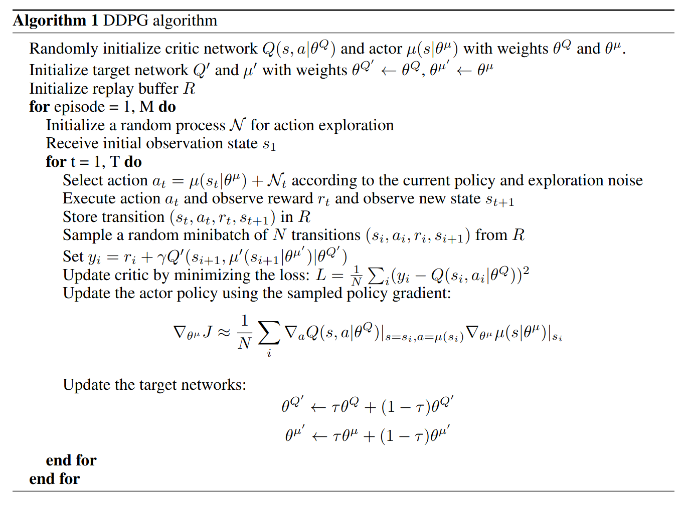
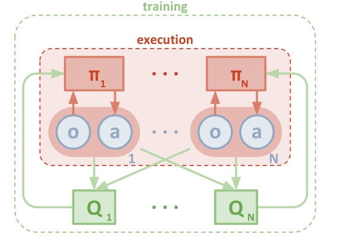
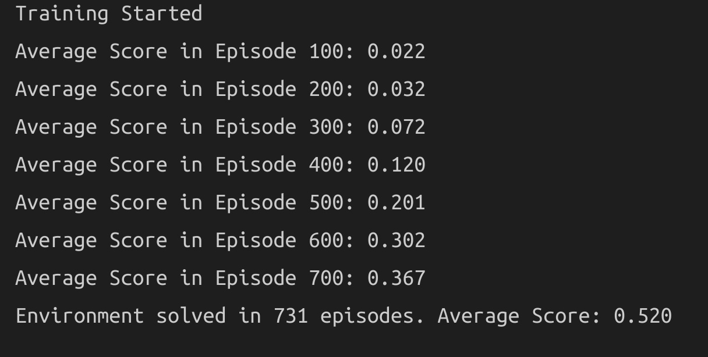
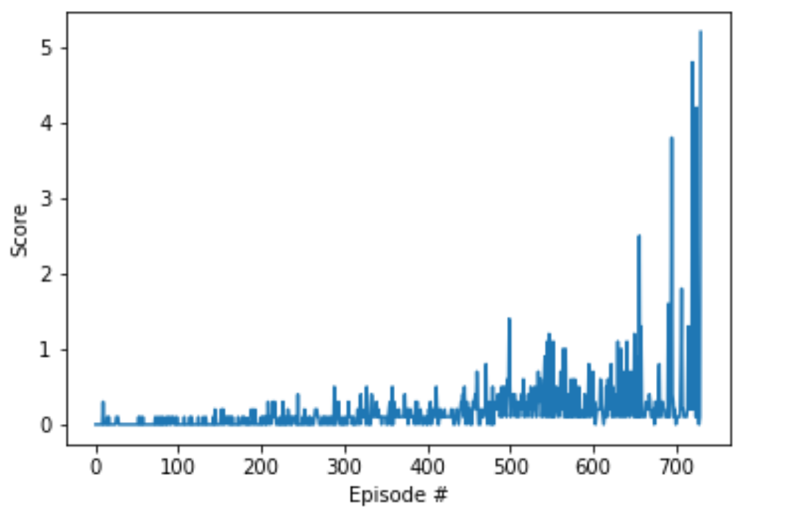
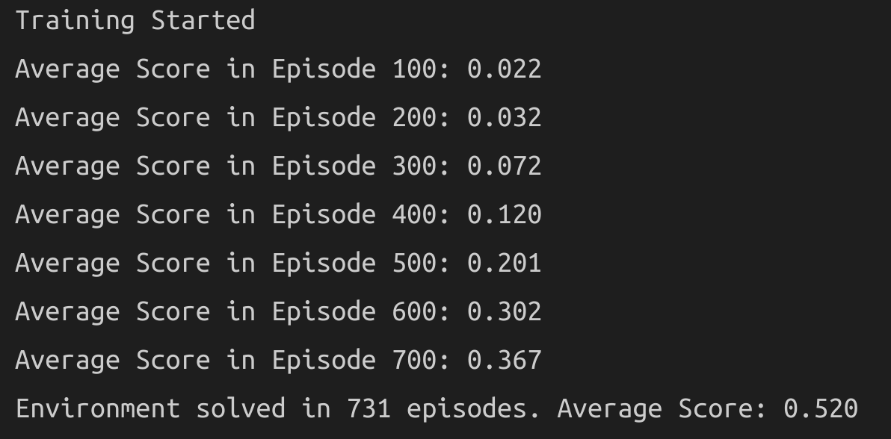
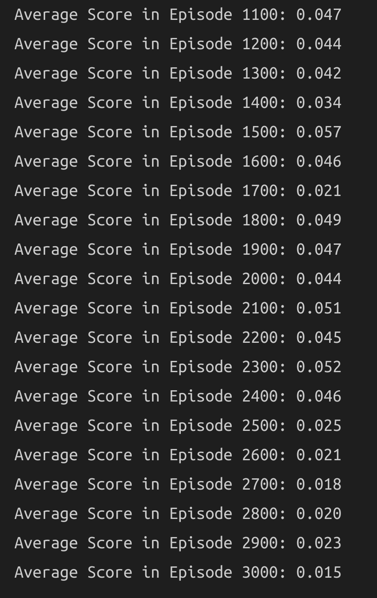
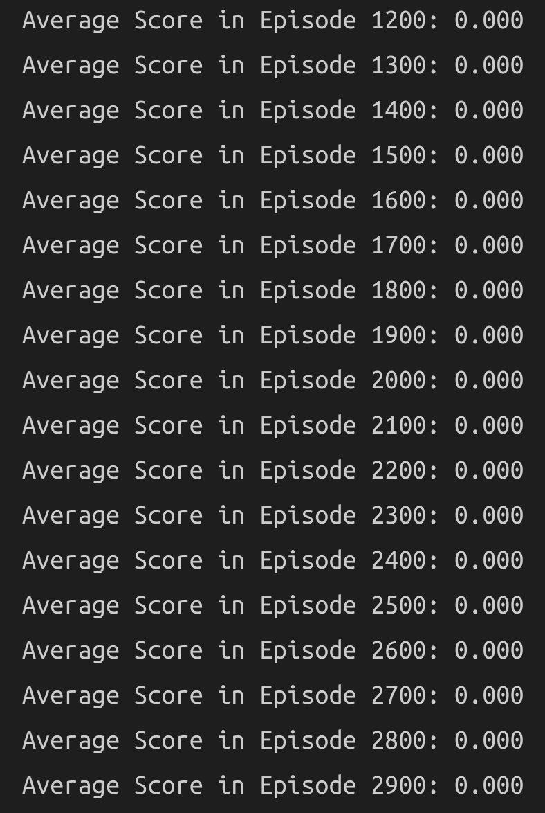
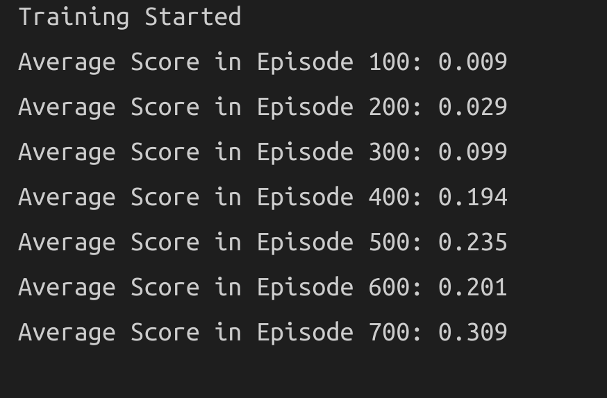
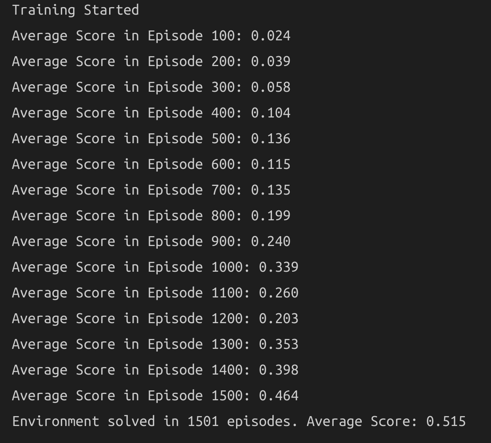

```{r setup, include=FALSE}
knitr::opts_chunk$set(echo = FALSE,message = FALSE,warning = FALSE)
```


# Description

This document is a report describing the learning algorithm and details of implementation, along with ideas for future work.

\pagebreak 

# Base Algorithms: DQN and DDPG

Deep Deterministic Policy Gradients, or DDPG for short, is an Actor-Critic Reinforcement Learning method [created](https://arxiv.org/pdf/1509.02971.pdf) to enable agents to better learn optimal policies to behave in continuous action spaces. DDPG borrows ideas from both `DQN` and `DPG` (DPG stands for Deterministic Policy Gradients).

The `DQN` is a method where a neural network is used is to implement the `Q-Learning` algorithm, which attempts to estimate action-value pairs in order to maximize the expected total reward and, therefore, to obtain the optimal policy for the given task. It belongs to class of value-based methods, whose goal is to solve the [bellman equation](https://en.wikipedia.org/wiki/Bellman_equation). Solving the bellman equation gives us the optimal policy, given that our environment meets certain criteria in our Markov Decision Process setting. For `Q-Learning` in particular the equation we're trying to solve is as follows

$$
\displaystyle Q^{new}(s_{t},a_{t})\leftarrow \underbrace {Q(s_{t},a_{t})} _{\text{old value}}+\underbrace {\alpha } _{\text{learning rate}}\cdot \overbrace {{\bigg (}\underbrace {\underbrace {r_{t}} _{\text{reward}}+\underbrace {\gamma } _{\text{discount factor}}\cdot \underbrace {\max _{a}Q(s_{t+1},a)} _{\text{estimate of optimal future value}}} _{\text{new value (temporal difference target)}}-\underbrace {Q(s_{t},a_{t})} _{\text{old value}}{\bigg )}} ^{\text{temporal difference}} 
$$

So in a given time step `t` we search for the action that maximizes the action-value pair $Q(s_{t+1},a)$ in order to estimate the optimal future value. DQN uses neural networks to step up from the traditional tabular method approach to the function approximation approach, which means that instead of storing the q-values in a table, we're going to encode it in a **parametrized** function approximator (parametrization what turn the q-value from $q(s,a)$ to $q(s,a;\theta)$). This gives us a lot flexibility to solve many other problems, specially those whose state space is continuous.

The figure bellow is the `DQN` implementation proposed in the [nature paper](https://storage.googleapis.com/deepmind-media/dqn/DQNNaturePaper.pdf). In that implementation there are two important additional tricks. Those tricks are employed in order to solve some instability that the neural network suffers in training. The first is experience replay and the second is the fixed q-targets.

Experience replay is mainly just creating a buffer to store some events (the $(S_{t},A_{t},R_{t},S_{t+1})$ action-pairs) and then latter using mini-batches of them to run gradient descent and learn the network weights. 

Fixed q-targets is a technique used to avoid a difficulty found in Q-Learning, where we update a guess with a guess, which can potentially lead to harmful correlations. In Q-Learning after each pass our neural network tries to get as close as possible to the target q-values, but the problem is that because we update the weights after each forward pass, our q-value target to calculate the loss function is always changing and that makes learning a bit unstable. To solve this problem the idea is to store the weights in another neural network $\hat{q}$ (called target network), freeze $\hat{q}$ the weights and update them every once in a while. Now when performing the learning step, our q-value loss function is the deviation from the forward pass calculated $q$ and the target (fixed) $\hat{q}$ value. That means that out "ground-truth" response variable is the fixed q-value from the target network and that makes learning more stable. 


The Deterministic Policy Gradients, or `DPG`, is an actor-critic method that attempts to combine both value-based and policy-based methods to learn an optimal policy IN continuous action spaces. Following the original paper, [Deterministic Policy Gradient Algorithms](http://proceedings.mlr.press/v32/silver14.pdf), on the `DPG`: 

> The deterministic policy gradient has a particularly appealing form: it is the expected gradient of the action-value function. This simple form means that the deterministic policy gradient can be estimated much more efficiently than the usual stochastic policy gradient.

The `DDPG` algorithm then is a mix of both `DPG` and `DQN`, where we have two networks: the actor and critic. The actor is responsible for estimating the value (or action-value) function while the critic is responsible for evaluating the value function. So the intuition behind actor-critic methods goes like this:

1. the actor takes in the current state and takes an action, based on the current policy $\pi(a|s;\theta_{\pi})$. 

2. collect the experience tuple $(s,a,r,s')$ to feed the critic, whose job is to estimate $V(s;\theta_{v})$. 

3. use the critic output to calculate the advantage function $A(s,a)=r + \gamma V(s';\theta_{v}) - V(s;\theta_{v})$ and use it as the new baseline for actor to move on.

4. Repeat steps 1 through 3 until a stopping rule is achieved (end learning).

But the `DDPG` algorithm is a bit different from classic actor-critic methods. The actor in `DDPG` is used to approximate $\max _{a}Q(s_{t+1},a)$, an expression found the original `DQN` implementation and not as a learn baseline. So instead of outputting $\pi(a|s;\theta_{\pi})$, the actor outputs $\mu(s;\theta_{\mu})$, an approximation of $\max _{a}Q(s_{t+1},a)$ (notice that this is follows an deterministic policy, not a stochastic policy). Then the critic takes the actor output and learns to evaluate it, by estimating $Q(s,\mu(s;\theta_{\mu});\theta_{Q})$. 

Besides that, `DDPG` is very much like what was described in steps 1-4. So in the `DDPG` algorithm implementation of steps 1 through 4 the actor will have two neural networks (a target and a policy network, like in the `DQN`) and for the critic we also have two neural networks (a target and a policy network, also like in the `DQN`). Also present in the `DDPG` algorithm is the replay buffer, in order improve learning by collecting some chunks of episodes. Also present are the fixed q targets used to help stabilize learning, as described in the `DQN` implementation. `DDPG` pretty much resembles the `DQN` algorithm, but addapted to support continuous action spaces. The `DDPG` is depicted in Figure 02.




\pagebreak

# Multi-Agents DDPG 

Multi-agents DDPG, or MADDPG, in an extension of the DDPG algorithm created for the purpose of allowing multiple agents to interact in collaborative or competitive and even mixed settings. The key idea behind the MADDPG algorithm is: decentralized agents learn a centralized critic based on the observations and actions of all agents. As explained in the [papers with code website](https://paperswithcode.com/method/maddpg):

> It leads to learned policies that only use local information (i.e. their own observations) at execution time, does not assume a differentiable model of the environment dynamics or any particular structure on the communication method between agents, and is applicable not only to cooperative interaction but to competitive or mixed interaction involving both physical and communicative behavior. The critic is augmented with extra information about the policies of other agents, while the actor only has access to local information. After training is completed, only the local actors are used at execution phase, acting in a decentralized manner.

Figure 3 shows an illustration fo the centralized critic, decentralized actor approach. Also known as centralized training and decentralized execution when training happens the critic for each agent has some augmented information about the environment, like all states and actions observed. But for the actor, it only has access to it's observed states and actions, not from other agents information. Also at execution time only the actor is present and because of that we use different rewards for each agent.



To get the MADDPG agent algorithm update from the classic DDPG, the key modification for the tennis environment is to create a shared replay buffer for both agent players. Also the score for each episode is taken to be the best score (max of both rewards) of the two agents, as the reward will be the same from all of them.

# Coding the Algorithm

The code DDPG implementation of the algorithm used here is mostly inspired the by "[Pendulum](https://github.com/udacity/deep-reinforcement-learning/tree/master/ddpg-pendulum)" project notebook provided by `Udacity`, in the "Actor-Critic Methods" section. Here is a brief description of the files:

- **Tennis.ipynb**: a jupyter notebook that serves as a wrapper of smaller functions. This is the main file, responsible for: 1) starting the environment; 2) loading the neural network architecture in `model.py`; 3) loading the `maddpg_agent.py` implementation, running it and saving model weights and score results.

- **model.py**: this is where the neural network architectures are stored, written in `pytorch`.

- **maddpg_agent.py**: this is code that implements the `MADDPG` high-level ideas of fixed q-targets, experience replay and Ornstein-Uhlenbeck noise. 

- actor and critic model weights for the two competing actor-critic MADDPGs:
    - `checkpoint_actor_0.pth`: first agent actor network
    - `checkpoint_critic_0.pth`: first agent critic network
    - `checkpoint_actor_1.pth`: second agent actor network
    - `checkpoint_critic_1.pth`: second agent critic network

- **maddpg_results.sav**: this a pickled object that contains the scores, average scores and time spent training.

## Comments on `maddpg_agent.py`

The `maddpg_agent.py` file contains the `pytorch` model architecture used to solve the environment. The input size that the network expects is the 8 variables corresponding corresponding to the position and velocity of the ball and racket. Each agent receives its own, local observation. Two continuous actions are available, corresponding to movement toward (or away from) the net, and jumping. 

The **Actor Neural Networks** use the following architecture.

```
Input nodes (8) 
  -> Fully Connected Layer (in: 8*2 nodes,out: 256 + Relu activation) 
      -> Fully Connected Layer (in: 256 nodes,out: 128 Relu + activation) 
         -> Ouput nodes (2 nodes, tanh activation)
```


The **Critic Neural Networks** use the following architecture :

```
Input nodes (8) 
  -> Fully Connected Layer (in: 8*2, out: 256 nodes + Relu) 
      -> Fully Connected Layer (in: 256+ 8*2, out: 128 nodes + Relu) 
         -> Ouput nodes (1 node )
```

The `hyperparameters` used are:

- the number of units in both first and second fully connected layer are 128.
- the learning rate parameter used in the `adam` optimizer for both actor and critic are `LR_ACTOR = LR_CRITIC = 1e-3` (this actually belongs to the `model.py` file, but it's also part of the neural network architecture)

## Comments on `model.py`

The `model.py` file contains:

- the `hyperparameters` used: 
    - `BUFFER_SIZE = 1e6`: replay buffer size (how much we store into the replay buffer)
    - `BATCH_SIZE = 128`: neural network mini-batch size
    - `LR_ACTOR = 1e-3`: the actor neural network learning rate use in gradient descent
    - `LR_CRITIC = 1e-3`: the critic neural network learning rate use in gradient descent
    - `WEIGHT_DECAY = 0.0`: L2 weight decay
    - `LEARN_EVERY` = 5: steps to wait until learning. Strategy used in the last ddpg multi-agent environment to stabilize training
    - `LEARN_NUM` = 5: number of learning passes
    - `GAMMA = 0.99`: the discount factor used in the discounted sum of rewards
    - `TAU = 1e-3`: the $\tau$ parameter used to soft update of target parameters
    - `OU_SIGMA` = 0.2: Ornstein-Uhlenbeck dispersion parameter
    - `OU_THETA` = 0.12: Ornstein-Uhlenbeck location parameter
    - `EPS_START` = 5.5: initial value for epsilon in noise decay process in Agent.act()
    - `EPS_EP_END` = 250: episode to end the noise decay process
    - `EPS_FINAL` = 0: final value for epsilon after decay
    
    
- the `Agent` class: 
    - implements the `step`, `act`, `learn` and `soft_updates` methods. Also has the `start_learn` to implement the idea to learn just after some episodes in order to help stabilize training (as suggested in the benchmark section)
    - initializes the policy and target networks for fixed q-target strategy for both actor and critic networks.
    - initializes the `ReplayBuffer` class.
    
- the `OUNoise` class:
    - implements the Ornstein-Uhlenbeck process in order to help exploration
    - hyperparameters used are the default already present in the udacity pendulum implementation. Namely:
      - `mu = 0`
      - `theta = 0.12`
      - `sigma = 0.2`
    - changed only to adapt the code the multiple agents environment
    
- the `ReplayBuffer` class: an API to 
    - initialize storage
    - implement the `add` (add new experiences) and `sample` (sample experiences to mini-batch GD learning) methods

\pagebreak

# Results

The `MADDPG` implementation was able to successfully solve the task of achieving an average score of +0.520 over 100 episodes in 731 episodes, as shown in the `Figure 04` bellow. It's important to note that we used a early stopping technique not to go into the 2000 episodes, if not needed. The plot of the scores is shown in `Figure 05`.






An important note about training is that I've experienced a **huge** instability. Sometimes the agent was able to solve the environment in even less than 731 episodes, but sometimes it didn't score anything. Probably it was due to some low good experience samples or even implementation problems. Some of the other tryouts are shown in the `Other Tryouts` section

\pagebreak

# Ideas to Explore Later

Some ideas that could lead to improvements in the learning process are trying to:

- revise the algorithm a lot more an try to make it more stable. 

- maybe explore more the batch normalization technique. For the cases that I've tried it I couldn't get out the slump and make the agent learn or learn more consistently just by using it. 

- an interesting approach to MADRL is to use adaptive policies, as presented in the paper [Multi-Agent Deep Reinforcement Learning with Adaptive Policies](https://arxiv.org/pdf/1912.00949v1.pdf).

- another thing to try out is the Minimax MADDPG, as presented in the paper [Robust Multi-Agent Reinforcement Learning via Minimax Deep Deterministic Policy Gradient](http://aima.eecs.berkeley.edu/~russell/papers/aaai19-marl.pdf). They try using the minimax optimization approach in order to make learning more robust to opponents with different strategies.


\pagebreak

# Other Tryouts



\pagebreak



\pagebreak



